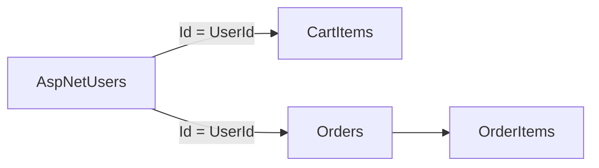

# ShopEase: users, carts, orders

## Individual accounts (ASP.NET Core Identity)

**Fit for this app:** Yes. One database (`ApplicationDbContext` → `IdentityDbContext`) holds Identity tables (`AspNetUsers`, `AspNetRoles`, …) and shop tables (`Products`, `CartItems`, `Orders`, `OrderItems`). Each user has a stable **string** id (default Identity key), available after sign-in as `ClaimTypes.NameIdentifier`. **Roles** (e.g. Admin) can be added later for an admin dashboard without replacing user storage.

## Cart tied to the account

Do not duplicate users in shop tables. **Reference** Identity’s user id:

| Concept | Implementation |
|--------|------------------|
| Who is logged in? | `[Authorize]` + `User.FindFirstValue(ClaimTypes.NameIdentifier)` |
| Cart ownership | `CartItem.UserId` = that string |
| Loading cart | `CartItems` where `UserId` matches the current user |

“Saving the cart to the account” means every `CartItem` insert/update uses the signed-in user’s id when cart actions require authentication.

## Orders tied to the account

- `Order.UserId` is set when checkout creates the order.
- `OrderItem` rows link to `Order` and `Product`, so purchases trace back through `Orders.UserId`.

## Customer journey (initial)

1. Login / Register (Identity UI).
2. Products list.
3. Product details — quantity, Add to cart (`CartItems` + current `UserId`).
4. Cart — review, proceed to checkout (shipping details).
5. Order placed — `Order` + `OrderItems`, cart cleared, stock adjusted.
6. Order confirmation, then return to browsing (e.g. Products).

Future changes (guest checkout, saved addresses, etc.) can build on the same **`UserId` on `CartItem` and `Order`** model.

---

## Current implementation status

| Area | Status |
|------|--------|
| Cart rows scoped by user | `CartItem.UserId` set from claims on add; cart/checkout load with `UserId` filter |
| Order tied to user | `Order.UserId` set in checkout when the order is created |
| Post-purchase | Cart cleared after order; redirect to order confirmation |
| Identity + one SQL DB | `ApplicationDbContext` + LocalDB/SQL Server connection |

---

## Out of scope (for a later phase)

- Admin dashboard (orders overview, per-user purchase history).
- Identity **role** seeding and `[Authorize(Roles = "Admin")]` (or policies) for admin pages.
- Order analytics / reporting beyond simple queries over `Orders` and `OrderItems`.

These do not block the main customer flow; they layer on top of the same `UserId` and role claims.

---

## Optional: stricter EF modeling

Foreign keys from `CartItem.UserId` and `Order.UserId` to `AspNetUsers` (`IdentityUser`) are configured in `ApplicationDbContext.OnModelCreating` (Cascade on cart rows, Restrict on orders so user deletion does not remove order history). Migration: `LinkCartAndOrderToIdentityUser` under `Data/Migrations/`.
